제컬 홈에서 제공하는 Step by Step 튜토리얼

[https://jekyllrb.com/docs/step-by-step/01-setup/](https://jekyllrb.com/docs/step-by-step/01-setup/)

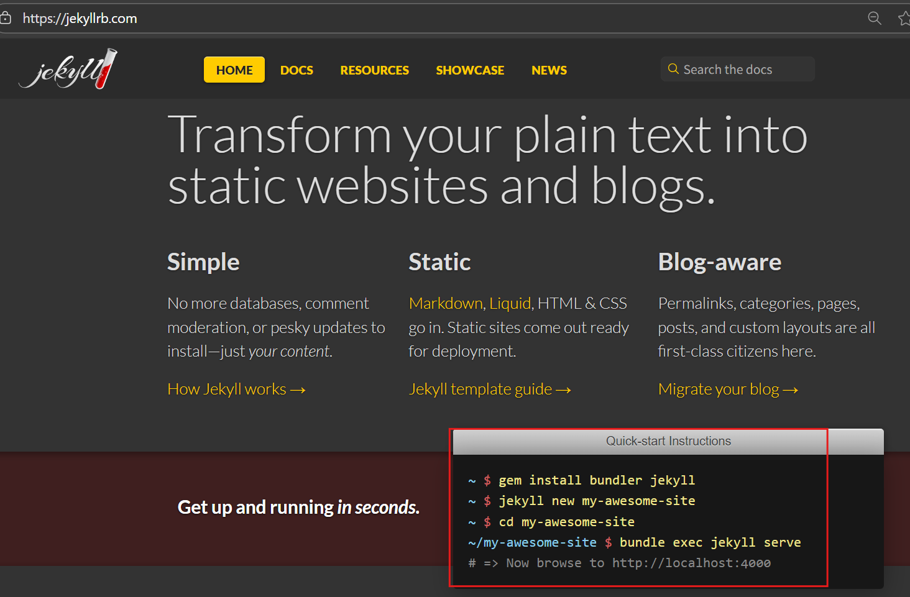

우리는 제컬이 필요 하고, 제컬은 루비를 필요로 합니다.  

위와 같이 제컬 홈에서 말하는 몇 초만에 웹사이트를 만들기 위해서는  
여러분의 컴퓨터에 이미 루비가 설치되어 있어야 합니다. 

이전 글 [루비설치하기]() 참조

루비가 이미 내 컴퓨터에 설치되어 있다는 전제 하에 계속 진행하겠습니다.

~ $ gem install bundler jekyll  
~ $ jekyll new my-awesome-site  
~ $ cd my-awesome-site  
~/my-awesome-site $ bundle exec jekyll serve

터미널에서 위의 명령을 차례로 실행해 보겠습니다.

### gem install bundler jekyll
먼저 gem install bundler jekyll 명령을 실행하겠습니다.

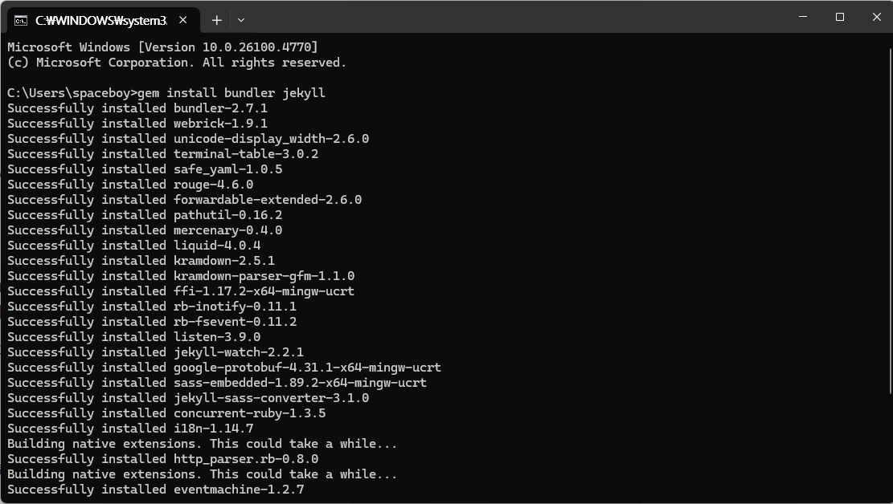

이 명령은 번들러 젬과 제컬 젬을 사용할 준비를 해달라고 루비젬에게 요청하는 명령입니다.  

### jekyll new my-awesome-site
두번째 명령 jekyll new my-awesome-site 명령을 실행하겠습니다.

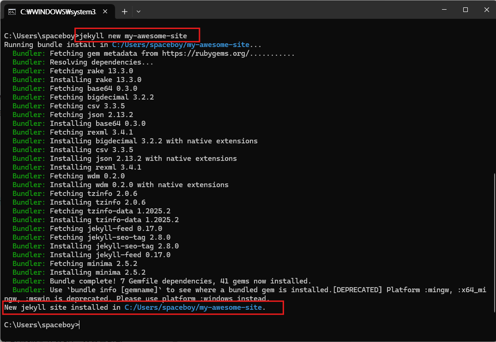

명령이 수행되고,  
새로운 제컬 사이트가  C:/Users/spaceboy/my-awesome-site 디렉터리에 설치되었다고 말합니다.  
이제 이 디렉터리로 이동하여 살펴 보겠습니다.

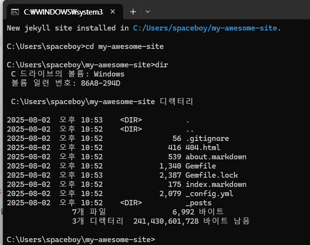

### bundle exec jekyll serve
계속해서 다음 bundle exec jekyll serve 명령을 실행하겠습니다.

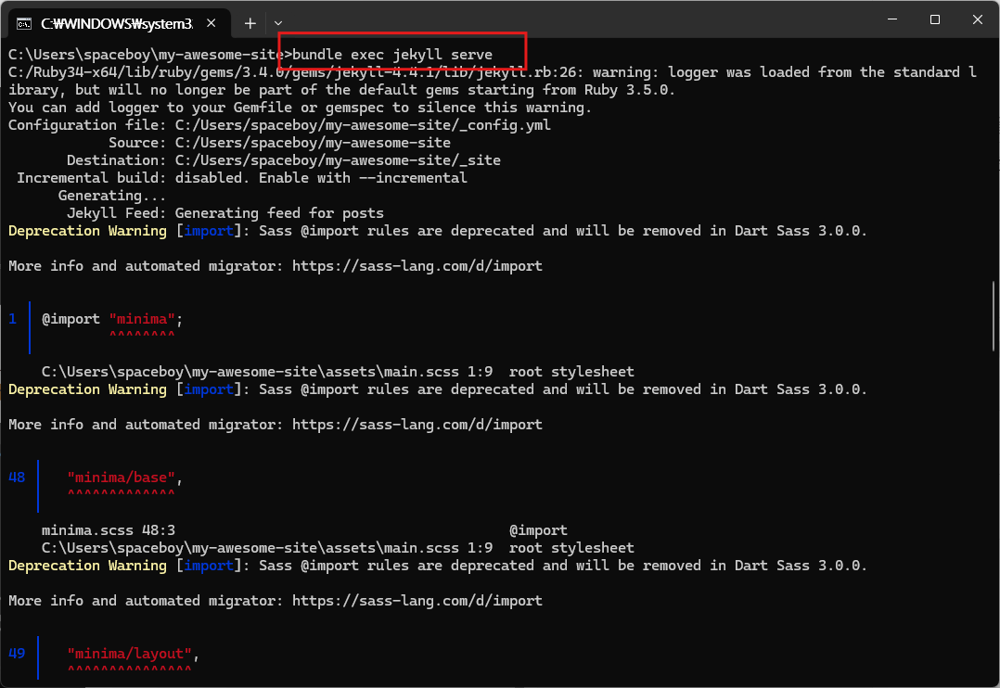

Deprecation Warning [import]: Sass @import rules are deprecated and will be removed in Dart Sass 3.0.0. 

경고 메시지가 나오지만 뭔가 계속 실행하고 있습니다.

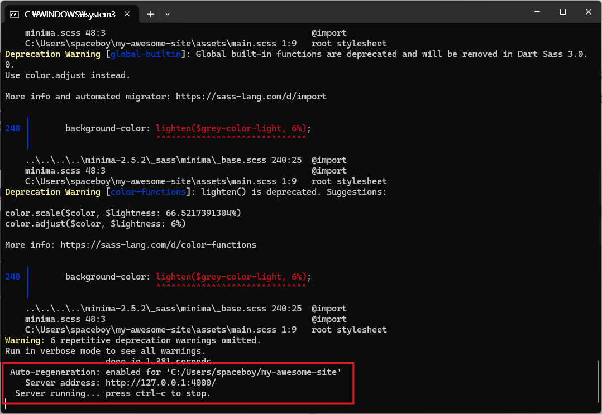

수없이 많은 경고 메시지에도 불구하고, 마직 3라인을 보면,  
현재 제컬 서버가 실행 중임을 알 수 있습니다.  
서버의 주소에 마우스 커서를 가져가서 Control 키를 누른 채 클릭합니다.

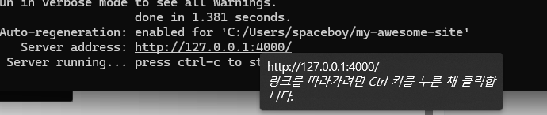

서버 주소를 클릭하면, 브라우즈가 열리고,  
우리의 제컬 웹사이트가 나타납니다.

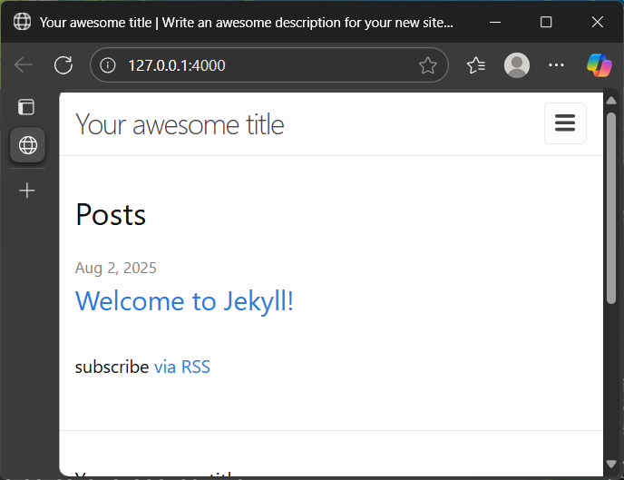

Welcome to Jekyll! 링크를 클릭하면

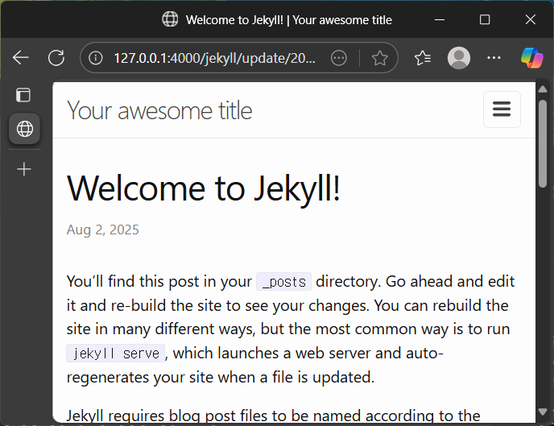

클릭한 포스트의 내용을 확인 할 수 있습니다.

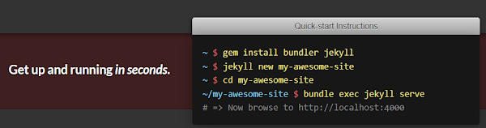

몇 초 만에 시작한다는 말이 과장은 아니군요.

다음 상단 메뉴의 DOCS 를 클릭하겠습니다.

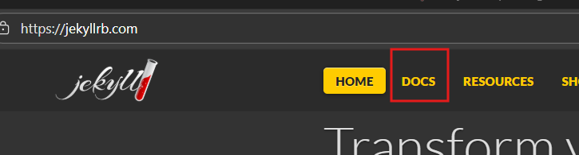

퀵 스타트 페이지가 나옵니다.

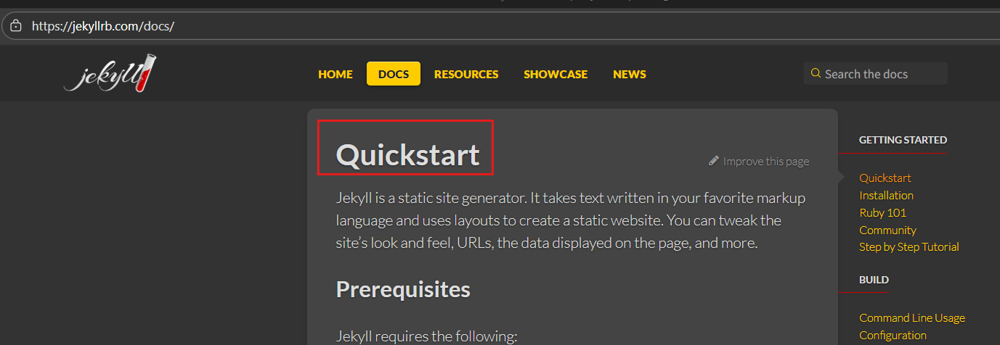

제컬 요구사항이 나옵니다.

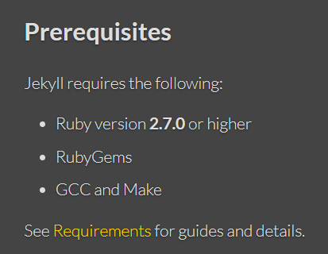

루비를 설치 하였다면, 만족한다고 생각하시면 됩니다.

다음 Quickstart를 위한 지시문이 나옵니다.

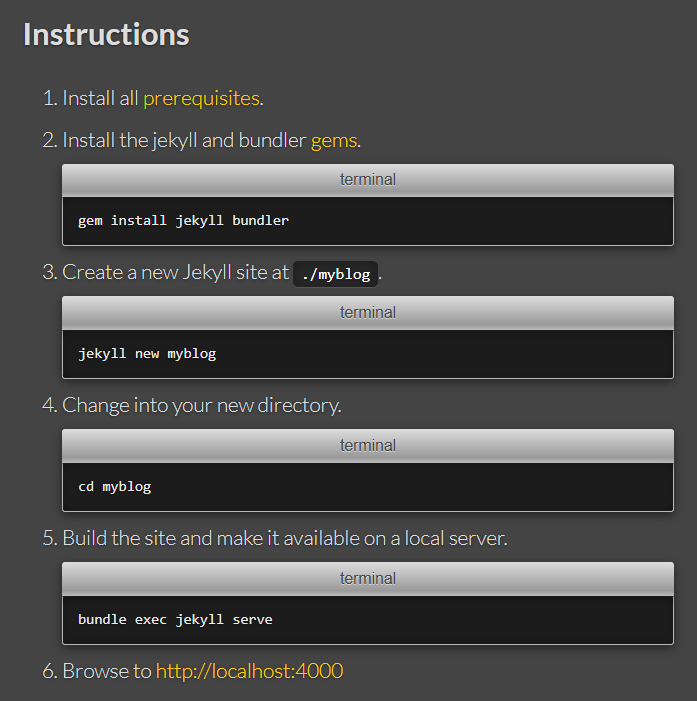

먼저 따라한 내용과 동일 합니다. 하지만 다시 한번 지시문대로 따라해 보겠습니다.

먼저 실행한 제컬서버가 실행 중이면, ctrl + c 를 눌러 서버를 중지 시킵니다.

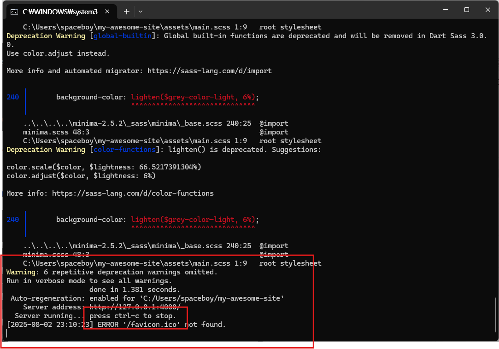

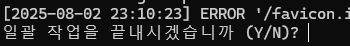

Y 엔터  

다음 2번의 gem install jekyll bundler 명령을 실행합니다.

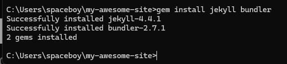

이번에는 바로 설치되었다는 메시지가 나옵니다.  
제컬이나 번들을 설치하는 데 필요한 젬들을 앞서 작업으로 모두 가지고 있으니 빨리 끝나는 겁니다.

3번 jekyll new myblog 명령을 실행합니다.

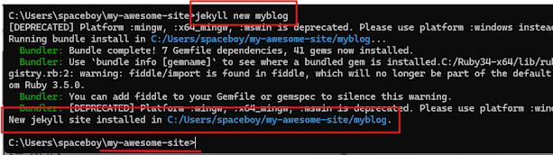

어라차차 여기서 작은 문제가 발생했습니다.

먼저 만든 my-awesome-site/ 사이트 폴더 안에 myblog 사이트를 만들었습니다.  
각 사이트는 자신의 폴더를 가지고 있어야 합니다.  
윈도우 탐색기에서 myblog 폴더를 상위폴더로 옮기는 방법을 선택하겠습니다.

먼저 잘라내기 선택

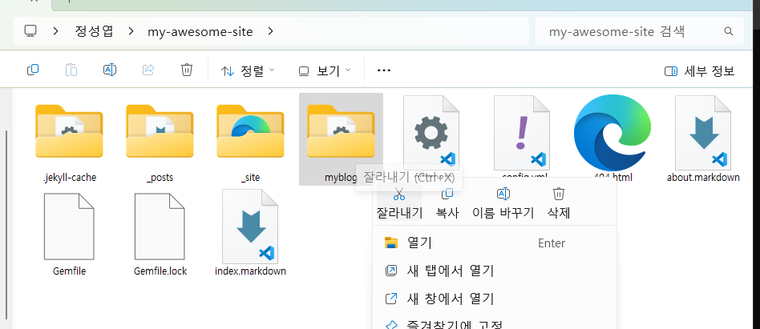

상위 폴더로 이동 붙여넣기 합니다.

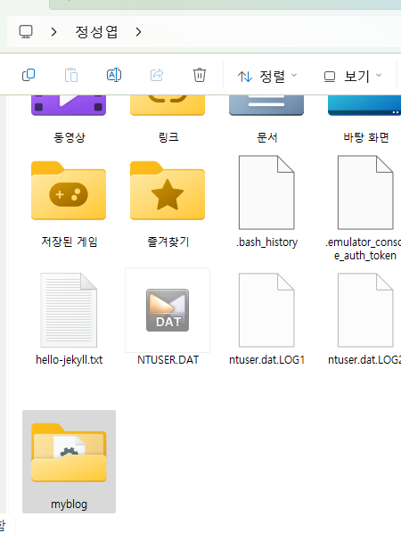

다시 명령창으로 가서 myblog 폴더로 이동해서  
5번의 bundle exec jekyll serve 명령을 실행합니다.

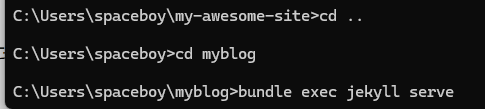

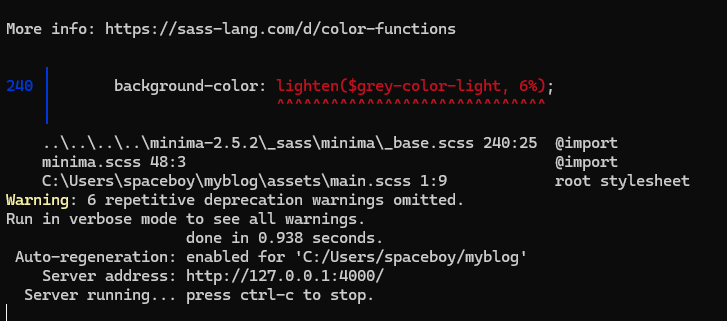

이전과 같이 경고 메시지가 출력이 되지만 서버가 시작이 됩니다.  
다시 서버 주소를 클릭해 브라우즈에서 확인 합니다.

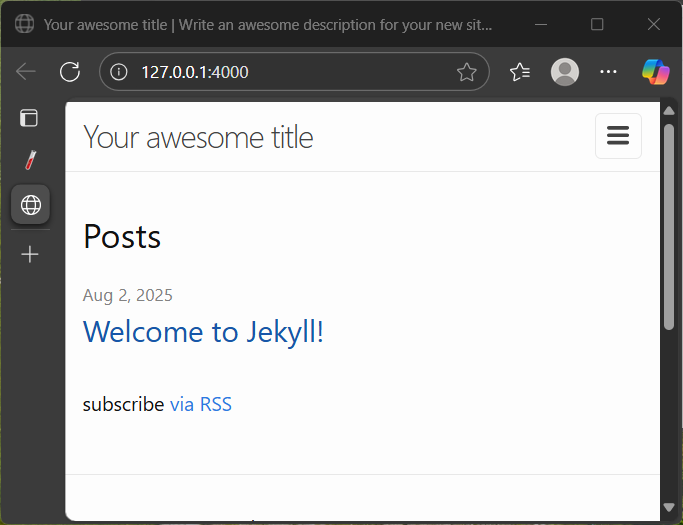

제컬 서버가 정상적으로 작동 함을 알 수 있습니다.

이제 진짜 Step by Step Tutorial 로 가 봅니다.

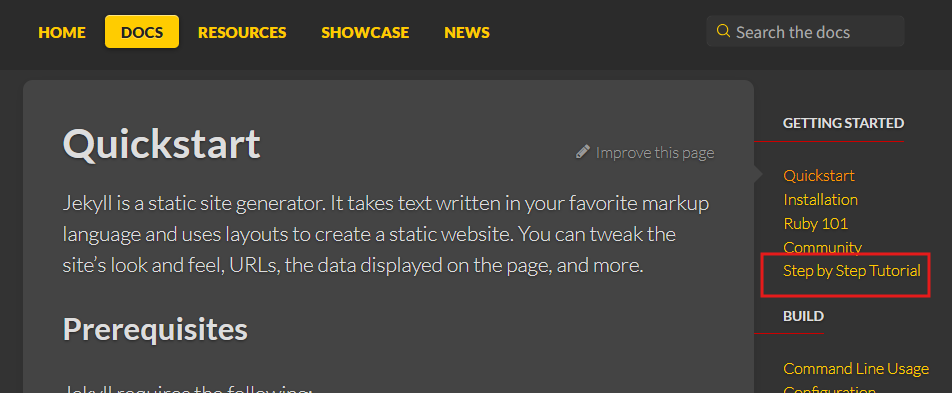

Step by Step Tutorial 은 다음 주제로 구분 되어 있습니다.

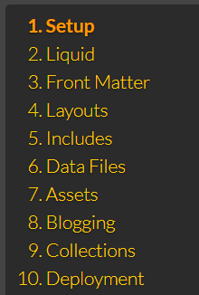

한 단계 씩 차분히 따라해 보겠습니다.

저의 경우 이 과정을 하나하나 따라하면서,  
와우 간략하고 핵심만 꼭꼭 집어서 준비했구나 하는 느낌을 받았고,  
제컬을 이해하는데 제컬 테마를 사용하는데 정말 도움이 된다고 생각했습니다.  
이미 HTML CSS Javascript 등 경력자 일수록 빨리 자신의 블로그를 가지고 싶은 사람일 수록   
반드시 한번 해보는 것을 강력히 추천합니다.  
몇 분 걸리지 않습니다. 

1. Setup 부터 보겠습니다.

   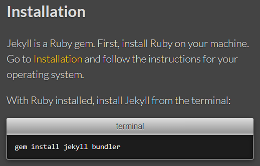

루비가 설치되어 있어야 하며,  
제컬젬과 번들젬을 설치해야 합니다. 우리는 이미 설치하였습니다.

### bundle init
다음은 bundle init 입니다.  
프로젝트의 디펜던시 목록을 가지고 있는 젬파일을 만듭니다.  
우리가 사용할 젬(gems) 이름과 버전을 이 젬파일에 적어 두는 겁니다.  
예로 자동차의 경우 Gemfile에 gem 자동차, gem 엔진, gem 기어 이런식으로요.

bundle init 명령은  
현재 디렉터리에 Gemfile 이 있는 경우, 현재 젬파일을 건드리지 않습니다.

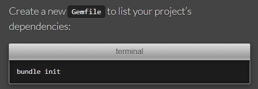

현재 디렉터리에 Gemfile이 없는 경우,   
새로운 빈 Gemfile 파일을 만듭니다. 

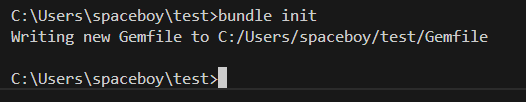

새로 만들어진 Gemfile에는  
필요한 잼들이 위치한 소스만 명시 되어 있습니다.

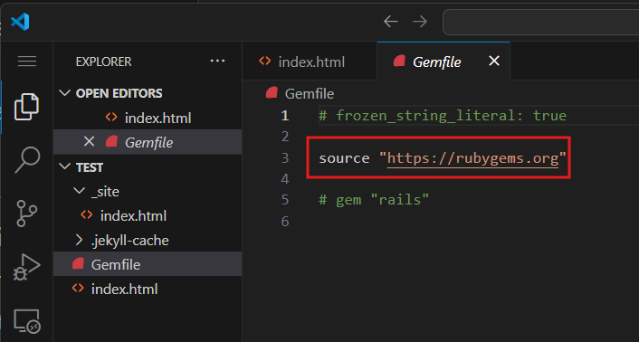

Gemfile에 gem "jekyll" 디펜던시를 추가합니다.  
쉽게 말하면 필요한 거 있으면, 여기에 적어 두라는 겁니다.  
그래서 우리는 제컬 젬이 필요합니다. 라고 말했습니다.

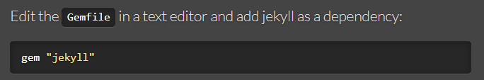

### bundle 
bundle 명령을 실행합니다.  
이 번들 명령은 소스에서 젬을 가져와 설치를 합니다.

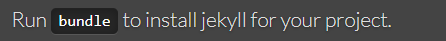

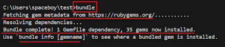

### bundle info
bundle info jekyll 명령을 실행하면,  
제컬 젬의 정보를 확인 할 수 있습니다.  
jekyll (4.4.1) 버전을 가져와 C: 드라이브에 설치가 되었네요.

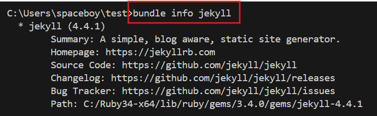

### bundle exec
제컬에 말할 때 bundle exec를 먼저 말하면,  
제컬은 Gemfile을 먼저 확인하고, 젬파일에 적어 놓은 버전을 실행하게 됩니다.  
이렇게 프로젝트의 버전을 관리 할 수 있습니다. 

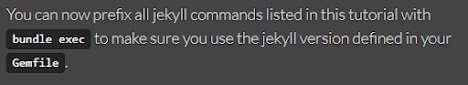

우리의 경우 첫 사이트는 jekyll new my-awesome-site,  
두번째 사이트는 jekyll new myblog 명령을 사용했습니다.  
이건 jekyll 젬에게 요청한 것이고,  
제컬 젬은 친절하게 Gemfile 을 만들어 줍니다.  
주석을 제거한 Gemfile의 모습을 보면 아래와 같습니다.

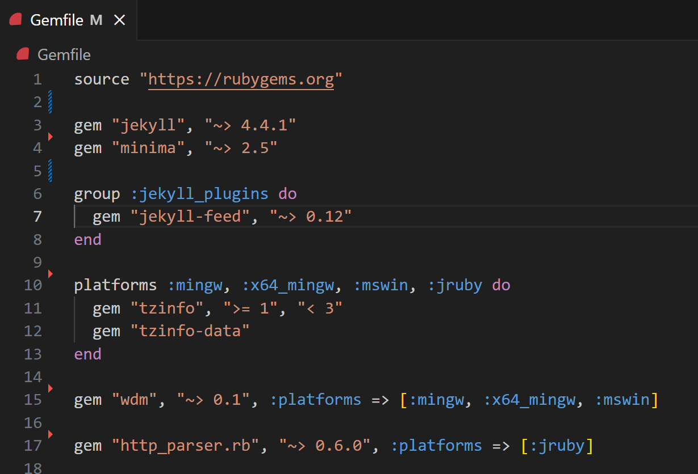

제컬이 정적사이트를 만드는데 필요한 젬 목록이 적혀 있습니다.  
우리는 그대로 사용하면 됩니다.

뭔가.

제컬이 만든 Gemfile 에는 많은 젬들이 있는데,  
gem "jekyll" 만 있어도 사이트가 동작 할까요?  
물론 여러가지 조건이 있겠지만, 제가 한번 해 보겠습니다.

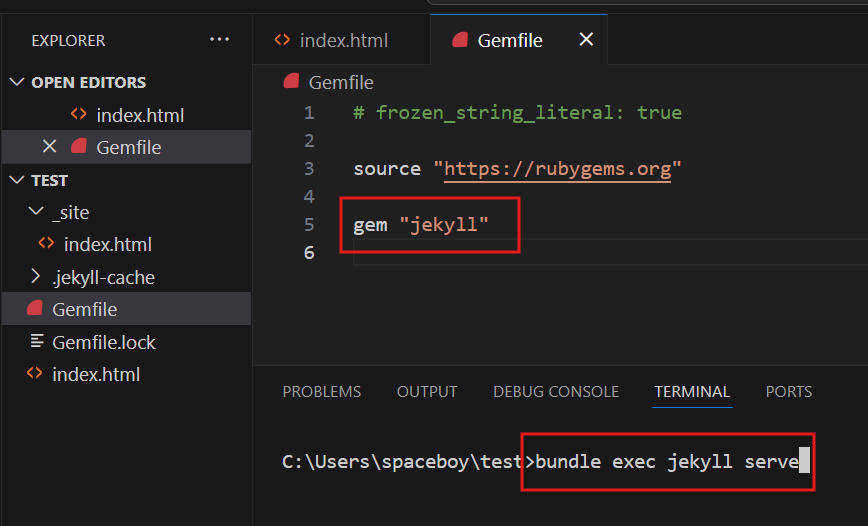

Gemfile에 제컬젬 하나만 두고,  
jekyll serve 앞에 bundle exec 를 붙여서   
Gemfile의 버전을 사용하라고  
제컬에 명령해 보겠습니다.

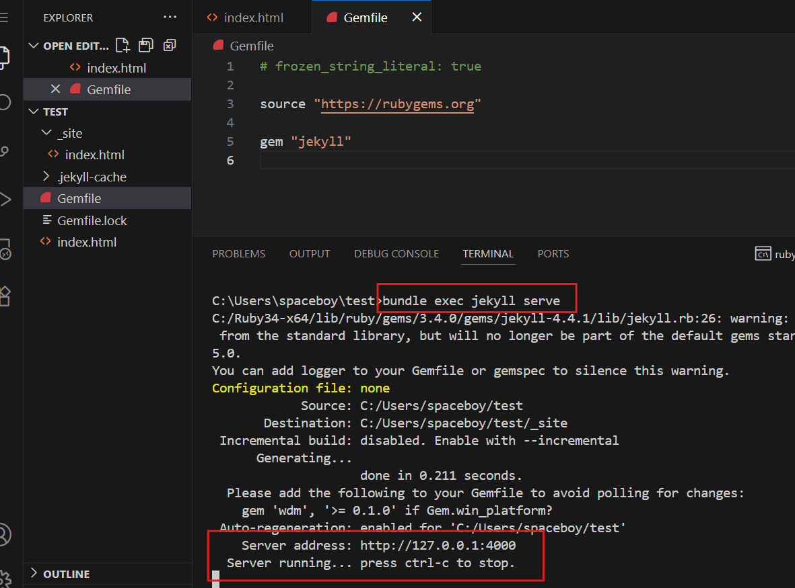

서버가 정상적으로 실행이 되고 있습니다.  
웹 브라우즈로 확인해 보겠습니다.

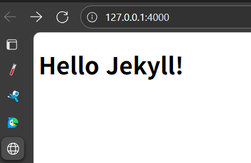

다음은 Create a site 섹션입니다.

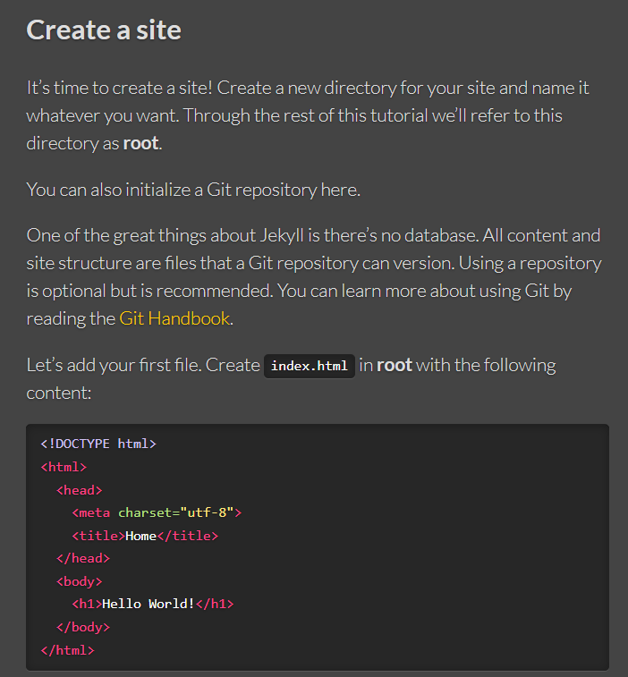
### index.html

이 부분은 index.html 파일을 위와 같이 만들어 보시기 바랍니다.  
myblog나 my-awesome-site를 만들었다면,  
여기에는 index.markdown 파일이 있고,  
index.html 파일은 없을 겁니다.

### jekyll build
다음은 Build 섹션입니다.

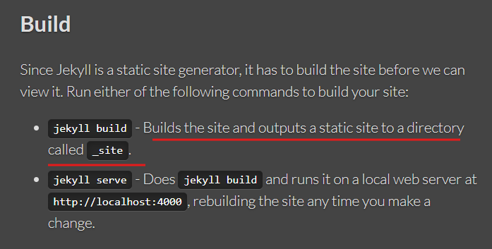

jekyll build 명령이 있습니다.  
이 명령은 웹사이트를 시작시키지 않고, 빌드만 합니다.  

우리가 작성한 html 또는 md 파일들을 읽어 변환 과정을 거쳐 _site 아래에 둡니다.   
_site 폴더가 없으면, 새로 생성합니다.  

한번 _site 폴더를 삭제하고, jekyll build 명령을 실행하십시오.

이전에 사용한 jekyll serve 명령은 jekyll build 명령을 포함하고 있습니다. 빌드 앤 런 입니다.

여기까지 Step by Step Tutorial 의 1. Setup 단계를 따라해 보았습니다.

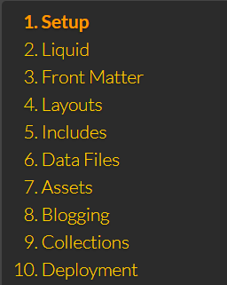

다음에 또 만나요.... 여기까지.