### 1. 루비 홈페이지 방문
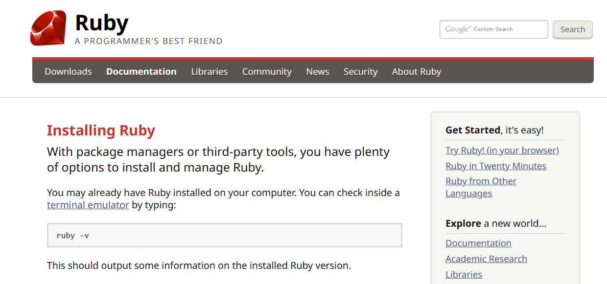
### 2. 다운로드 루비
[https://rubyinstaller.org/downloads/](https://rubyinstaller.org/downloads/)
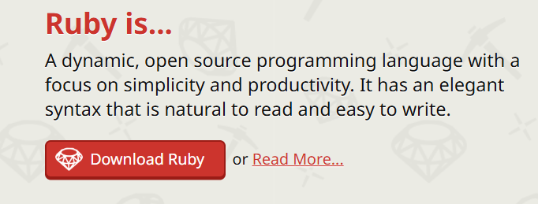

### 3. 루비버전 선택
어떤 버전을 설치해야 하나?  
저를 기준으로 win11 64비트 기준으로 설치를 진행해 보겠습니다.  
추천 버전은(기준 2025년8월) RubyInstaller 3.4.5-1(64비트)를 권장합니다.  
여기에는 IRB, RubyGems, DevKit 등이 포함되어 있습니다.

### 4. 설치 시작
다운로드 했습니다. 이제 더블 클릭해서 설치를 시작해 보도록 하겠습니다.

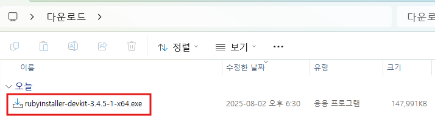

시작 부터 난관이네요. 윈11이 PC를 보호해 주겠다며, 시작을 차단 하였습니다

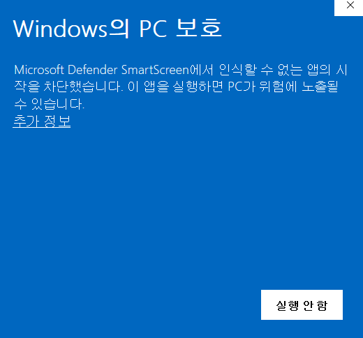

저는 [https://rubyinstaller.org/downloads/](https://rubyinstaller.org/downloads/) 사이트를 통해 직접 다운로드 했으므로  
추가 정보를 클릭해서 설치를 진행하겠습니다.  
다시 한번 묻습니다. 계속 진행하겠습니다.  
실행을 클릭.

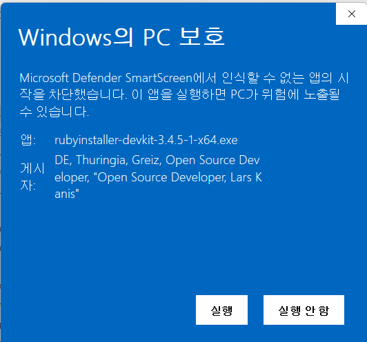

### 5. 설치 모드
설치 모드를 선택하라고 묻습니다. Install for me only(recommended) 추천 항목을 선택.

### 6. 라이센스 수락을 선택합니다.

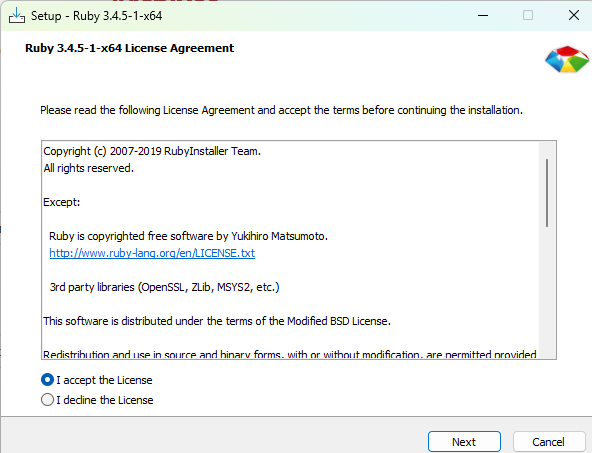

### 7. 설치 위치
설치할 위치를 묻는데, 그대로 두고 설치(Install) 버튼 클릭. 설치가 시작됨.

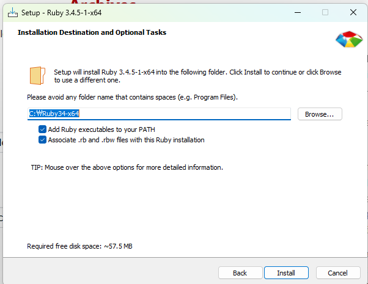

### 8. 컴포넌트 선택
컴포넌트 선택 대화상자 에서 다음(Next) 버튼 클릭

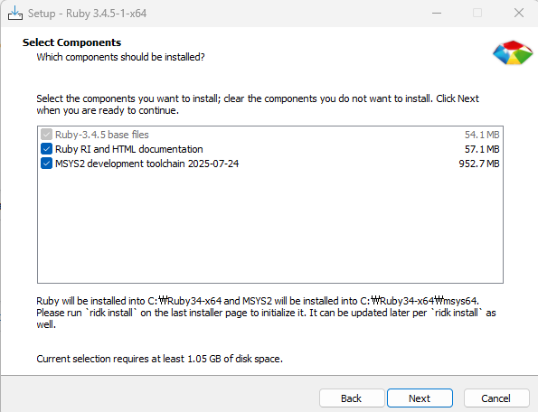

### 9. 설치 중...
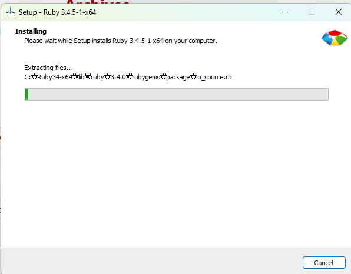

### 10. 설치 완료
몇 분의 시간이 흐른 후 설치가 완료 되었습니다.
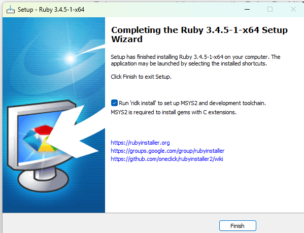

### 11. Finish
그대로 Finish 버튼을 클릭해서 루비 설치를 마친다.
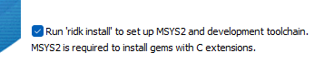

### 12. Run 'ridk install'
Run 'ridk install' to set up MSYS2 and development toolchain. MSYS2 is required to install gems with C extensions. 항목이 체크 된 상태에서 Finish 버튼을 클릭했기 때문에 다음 설치를 진행 할 것인지 묻는다. 여기서 3  을 입력하고 엔터.
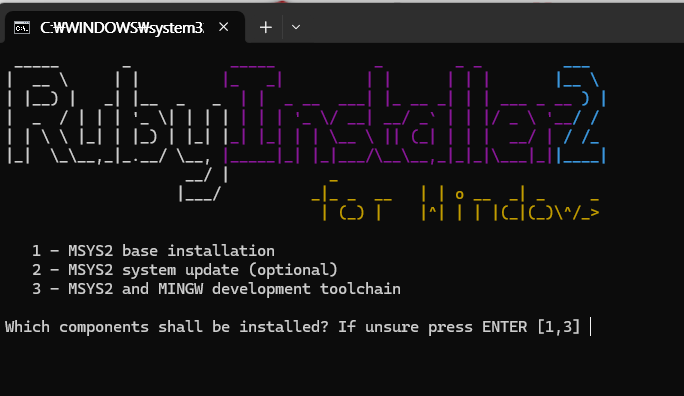

ridk install 이 진행됩니다.

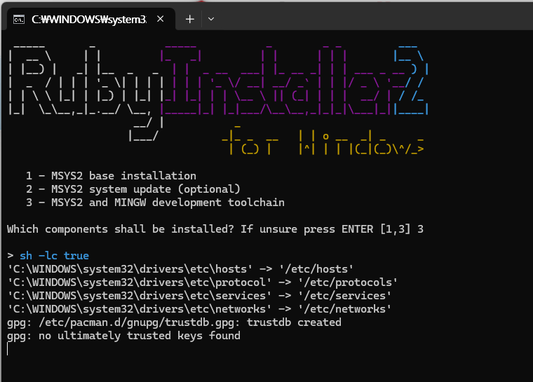

설치가 쭉 진행되고, 또 뭐지?

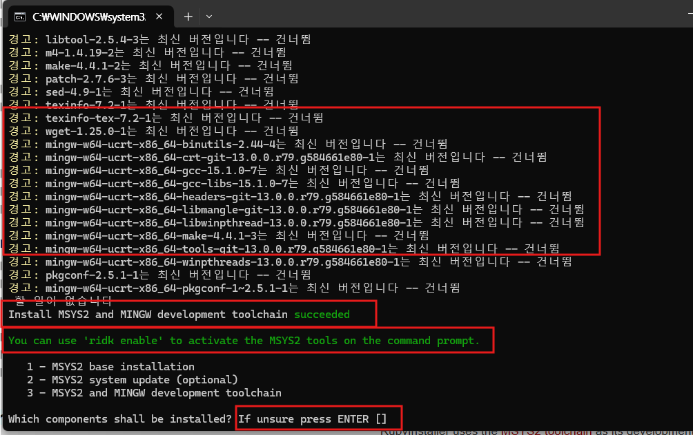

최신 버전입니다 -- 건너뜀 OK, MSYS2 와  MINGW 개발 툴 체인 성공,  
명령창에서 MSYS2 도구를 활성시키려면, ridk enable 명령을 사용해라.  
그리고 1, 2, 3 항이 나오는데, 처음 본 내용과 같습니다.  
우리는 3을 선택해 설치했었고,  
메시지가 조금 이상하지만, If unsure press Enter [ ] 이라고 되어 있으니  
저는 그냥 엔터.

### 13. 루비 설치 확인
설치 창이 그냥 닫혀 버립니다. 간단히 설치가 되었는지 확인하겠습니다.  
명령창을 하나 열어 ruby -v 명령을 사용합니다.
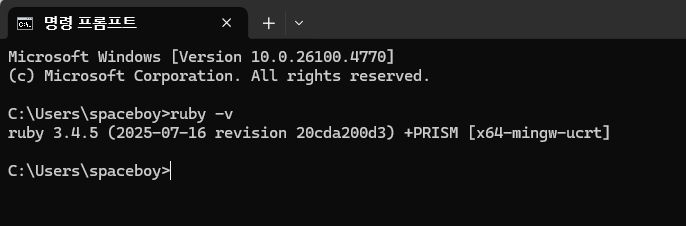

### 14. 동작은 하나요?
우리가 선택한 루비 3.4.5 가 설치가 되었습니다. 동작은 하나요? 간단하게 확인해 보겠습니다.

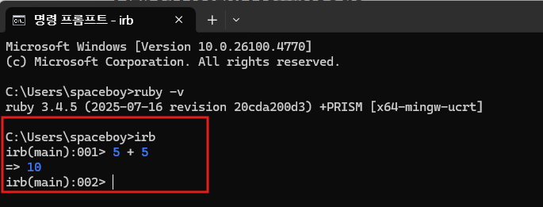

irb 명령은 루비에 속하는 대화형 루비를 실행하는 명령입니다.  
대화형과 반대되는 상황은 우리가 제컬과 대화하는 데 HTML 을 사용하듯이  
루비와 대화하는데 확장자가 .rb인 파일을 사용하는 경우가 되겠지요.

위에서 보듯이 우리가 irb를 통해 루비에게 5 + 5 가 얼마냐고 물으면,  
루비는 우리의 컴퓨터를 사용해서 계산한 후 irb를 통해 10 이요. 라고 답해 주는 거죠.

우리는 제컬을 사용해 블로거나 포트폴리오 웹사이트가 주 관심사이므로 루비에 대해서는 이 설치로 마무리 하겠습니다.

다음 글에서 ...

​    

