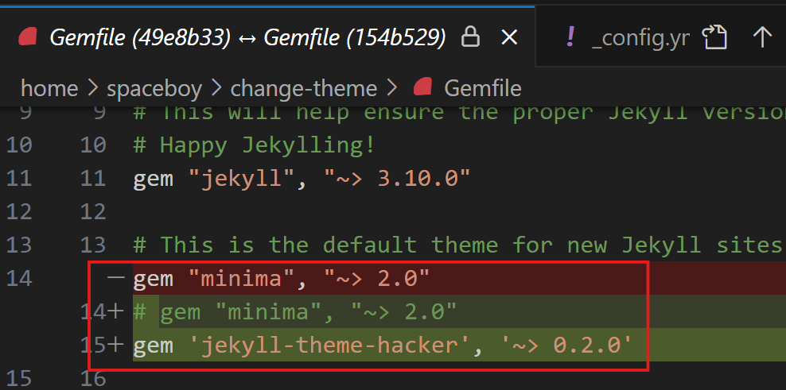
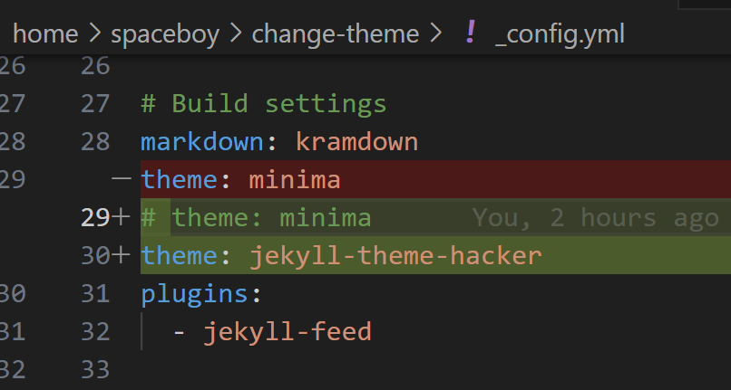
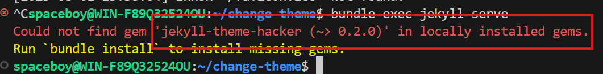
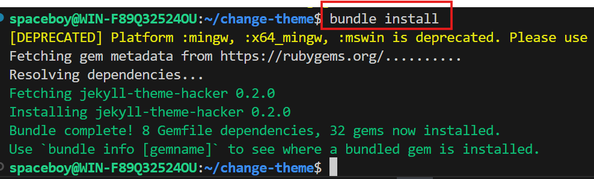
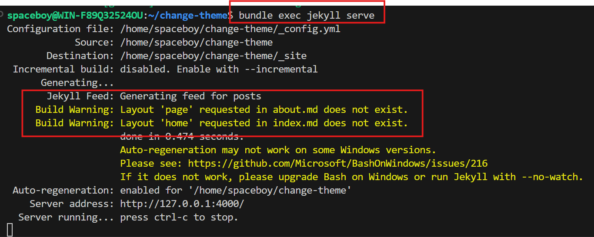
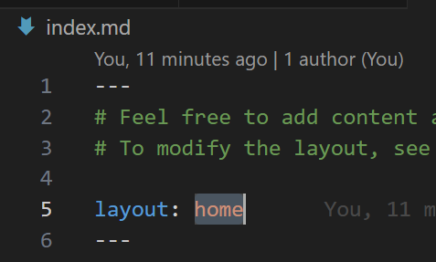
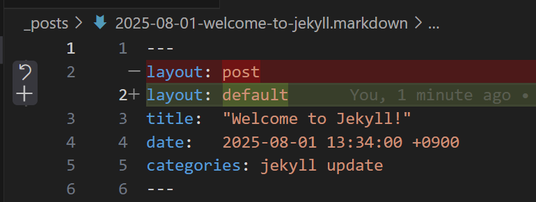

제컬 테마 변경
8월 01, 2025
 제컬의 테마를 기본 테마인 미니마 에서 해커 테마로 바꾸기...

테마를 바꾸기 위해서는 Gemfile 과 _config.yml 파일에서 수정이 필요합니다.

Gemifle

미니마를 #으로 코멘트로 처리 하고, 해커 테마를 추가한다.

_config.yml

여기에서도 테마 변수의 값을  minima에서 jekyll-theme-hacker 으로 바꾼다.

위 2개의 파일 변경 후 저장

이제 제컬 서버를 실행해서 결과를 확인 한다.

터미널에서 bundle exec jekyll serve 명령을 실행한다.

jekyll-theme-hacker 젬이 로컬에 설치 되어 있지 않으니,   

bundle install 명령으로 설치하라는 메시지가 출력이 된다.

지시한 대로 bundle install 명령을 터미널에서 입력한다.

다시 터미널에서 bundle exec jekyll serve 명령을 사용하여 제컬 서버를 시작한다.

이번에는 제컬서버가 실행이 된다. Server address: http://127.0.0.1:4000/을 클릭하여 브라우즈에서 확인하면 빈 페이지가 보인다.

위의 메시지를 보면 2개의 경고 메시지가 있다. 레이아웃 페이지 와 홈이 없다고 나온다.

index.md 파일을 열어보자

index.md 파일에서 레이아웃으로 home을 사용하고 있다. 하지만 변경하고자 하는 해커 테마에는 home 레이아웃이 없다. 이것을 default로 바꾸어 준다.

about.md 파일에서도 같이 변경해 준다

브라우즈의 주소창에 http://localhost:4000/ 를 입력해 확인한다.

이번에는 소개 페이지도 확인한다. url은 http://localhost:4000/about 이다

 

페이지의 아래쪽으로 about.md의 내용이 출력된다.

어떡해 1

하다 보면 이런 화면을 볼 수 있다.

아주 유명한 404 페이지를 찾을 수 없다. 정말 많이 만나는 HTML 메시지 중 하나입니다.

이때는 제일 먼저 브라우즈의 주소창을 보아야 합니다.

주소가 about.html 로 끝이 납니다. 

http://localhost:4000/about/

http://localhost:4000/about

으로 확인하면 페이지가 표시 되는데, 왜? about.html은 안되지!

뭐야!

현재 우리가 만든 사이트에는 about.html이라는 페이지가 존재하지 않습니다. 그것이 찾지 못하는 이유 입니다. 

이 글을 보는 분이라면, 이미 about.md 파일은 제컬에 의해 자동으로 컴파일되어 html로 바뀐다고 알고 있습니다. 그런데 뭐지!

맞습니다. 맞고요. 분명 about.md 파일을 제컬이 html로 바꾼 것은 맞습니다. 하지만 말입니다.

제컬이 바꾼 파일의 이름이 index.html 입니다. about.html이 아니고요.

확인해 보겠습니다.

 

제컬은 스테틱 웹사이트로 제컬 서버가 실행되면 더 이상 바뀌지 않습니다. 또한 실행하기 전에 모두 HTML로 변환 시킵니다. 이 변환된 파일을 저장하고 서비스 하는 디렉터리가 _site 폴더 입니다. 우리가 변경 할 필요가 없는 디렉터리 입니다.

제컬은 about.md 파일을 _site 폴더 아래에 about 폴더를 생성하고, index.html 이라는 이름으로 변환하게 됩니다.  

그러니, 현재 우리의 사이트에 about.html이라는 이름을 가진 파일은 없다 이겁니다.

고고~

다음 포스터 입니다. 우리는 현재 _post 디렉터리에 긴 이름의 파일을 하나 가지고 있습니다. 

2025-08-01-welcome-to-jekyll.markdown 

블로그는 이 긴 이름의 파일이 하나의 포스터가 되어, 여러 개의 포스터로 하나의 블로그가 만들어 지게 되어 있습니다. 

제컬은 이 포스터 하나를 하나의 페이지로 바꾼다고 알고 있습니다. 

어떡해 !

이 포스터를 지금 확인하고 싶은데, 현재 사이트에는 페이지 사이를 이동할 메뉴가 없습니다. 하지만 말입니다. 우리는 이미 네비게이션이 없이도 about 페이지를 확인했습니다. 같은 방법으로 이 포스트도 확인 하면되겠습니다.

주소창에 저 포스트의 주소를 입력해야 하는데, 

어떡해 ! 

분명 테마를 해커로 바꾸기 전, 미니마 테마에서는 저 포스터를 보았던 것 같은데, 맞습니다. 미니마 테마에서 접근한 주소를 사용하면 해커 테마에서도 저 포스터를 볼 수 있습니다

어떡해!

그 주소가 뭔지 지금은 알 수가 없잖아. 처음 jekyll new my-awesome-site로 만들어 실행했을 때는 그냥 클릭 클릭해서 이동해 보았지 주소창은 처다보지도 않았었는데, 그걸 어떻게 기억해-

해결방법

지금 사이트를 지우고, 다시 처음부터 시작해서 미니마 테마에서 주소를 확인해 포스터의 주소를 확인하는 방법입니다.

미쳤냐! 예 이제 처음 반복하는건데 해야지요. 그런데 말입니다. 이런 때 좋은 도구가 있습니다.

바로 깃이죠. 

저는 기억 할 수 없지만 깃은 얼마든지 기억할 수 있습니다. 하지만 우리가 깃에게 기억할 지점을 말해 줘야 합니다. 저는 위 initial commit jekyll new change-theme 라는 지점에 처음 디폴트 테마로 사이트를 생성했을때 깃에게 기억하라고 일러 두었습니다.

따라서, 저 지점으로 되돌려 다시 제컬 서버를 기동해 포스터의 주소를 확인 해 보도록 하겠습니다.

포스트의 주소는 http://127.0.0.1:4000/jekyll/update/2025/08/01/welcome-to-jekyll.html 입니다. 참 길죠. 일단 노트패드에 복사해 붙여넣고, 

이제 다시 해커 테마가 기억된 지점 change theme minima to hacker 으로 돌아 오라고 깃에게 명령합니다. 돌아 온 후 다시 제컬 서버를 시작시키고, 노트패드에 복사한 주소로 이동 합니다.

화면의 아래쪽으로 포스터의 내용이 출력이 됩니다.

깃은 이런 경우에 확인하기 쉽구나 를 알려드리고, 반드시 알아두어야 할 내용 중 하나라 말씀드리기 위해서이고, 이 단계에서는 여러분이 생성한 파일의 이름이 날짜 부분만 저와 다르기 때문에

여러분이 생성한 파일 이름 부분을 참조하여 주소를 입력하면 이 단계에서도 포스터의 내용을 참조 할 수 있습니다.

그런데 말입니다. 

이러한 http://127.0.0.1:4000/jekyll/update/2025/08/01/welcome-to-jekyll.html  긴 주소는 어디에서 온 걸까요? 

포스터 파일이름을 사용한 것 같은데 /jekyll/updat 는 도대체 어디에서 온 걸까요. 

포스터 파일을 보면, categories: 항목이 있고, 여기에 jekyll update 가 있습니다.

바로 이 카테고리 항목을 제컬이 포스터의 주소를 만드는데 사용하고 있습니다.

현재 기본적으로 이렇게 처리 한다는 것이고, 우리는 필요에 따라 제컬에게 다르게 요청 할 수도 있습니다. 간단하게 알리는 방법을 살펴보면, 

_config.yml 파일에

permalink: /:categories/:year/:month/:day/:title.html

permalink: /:year/:month/:day/:title.html

위와 같이 permalink 사이트 변수를 설정하여 바꿀 수 있습니다.

저의 첫 번째 블로그 글을 봐주셔서 대단히 감사 합니다.

앞으로 제컬과 관련된 글을 조금씩 올리도록 하겠습니다.